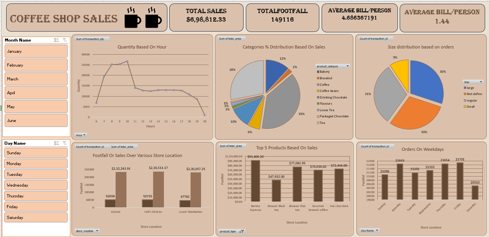

📊 Coffee Shop Sales Analysis

📌 Project Overview
This project analyzes coffee shop sales data using an interactive Excel dashboard.  
The goal is to identify business problems, analyze sales trends, and generate actionable insights to support data-driven decision-making. 

🎯 Objectives
- Analyze overall sales performance  
- Identify peak hours and high-performing days  
- Evaluate product and category contribution  
- Compare store-level performance  
- Detect underperforming products  

 🛠 Tools Used
- Microsoft Excel  
- Pivot Tables  
- Data Visualization  
- Dashboard Design  

📊 Key Analysis
- Hourly and daily sales trends  
- Category-wise revenue distribution  
- Top-performing products  
- Store performance comparison  
- Customer order behavior  

🔍 Key Insights
- Morning hours generate highest sales  
- Coffee category drives major revenue  
- Few products contribute most of the sales  
- Sales vary across weekdays  
- Slight performance differences across stores  

 🚀 Future Scope
- Profit and cost analysis  
- Sales forecasting  
- Customer segmentation  
- Inventory optimization  

📷 Dashboard Preview

⭐ This project demonstrates practical application of Excel for business intelligence and sales analysis.
